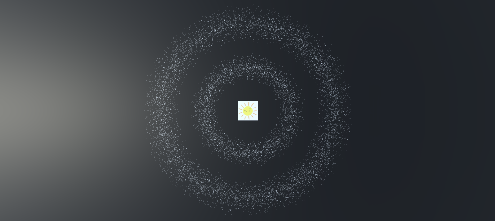
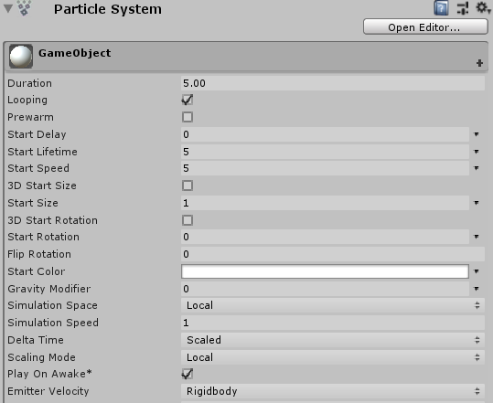

# 3D游戏编程第七次作业
| 姓名| 学号| 日期|
|:-:|:-:|:-:|
| 张浩轩| 17343149| 2019/11/04|  

- [粒子光环](#title)
- [运行截图](#img)
- [具体实现](#complement)

</br>

<h2 id="title">粒子光环</h2>  

作业要求: 
- 参考 http://i-remember.fr/en 这类网站，使用粒子流编程控制制作一些效果， 如“粒子光环”  

<h2 id="img">运行截图</h2>

  
  

<h2 id="complement">具体实现</h2>

本次作业比较简单, 三选一题目, 不用全部完成. 我选的是粒子光环题目, 因为实现完成后的效果比较好看. 下面就来一一进行粒子光环实现过程的分析.  

首先要在Gameobject中添加Component\<Particle System\>  
  
然后新建C#脚本, 直接挂载到Gameobject上, 命名随意.  
关键是脚本里面的内容, 其实关键点就几个而已, 一个是Particle System, 另外一个是粒子数组, 用来控制System中的粒子  
```c#
private ParticleSystem particle_system;
private ParticleSystem.Particle[] particle_arr;
```  
脚本声明的全部变量如下  
```C#
public class ParticlePosition {
    public float radius = 0, theta = 0, target_radius = 0, animation_time = 0, speed = 0;
    public int speed_level = 0;
    public ParticlePosition(float radius, float theta, int level) {
        this.radius = radius;
        this.theta = theta;
        this.speed_level = level;
    }
}
private ParticleSystem particle_system;
private ParticleSystem.Particle[] particle_arr;
private ParticlePosition[] particle;
public int count = 20000;
public float min_radius = 5.0f;
public float max_radius = 12.0f;
public float theta_unit = Mathf.PI / (180 * 5);
public int direction = 1;
private float radius_unit = 0.008f;
private float small_min_radius = 3.0f;
private float small_max_radius = 6.0f;
private float position_now = 1;
private float time = 0;
private bool animation_start = false;
```
在Start中添加初始化代码, 比较简单, 用来初始化各个变量.  
```c#
void Start() {
    particle_system = GetComponent<ParticleSystem>(); // this particle_system
    particle_arr = new ParticleSystem.Particle[count]; // the number of particle
    particle = new ParticlePosition[count];

    particle_system.startSpeed = 0;         
    particle_system.startSize = 0.02f; // the size of particle
    particle_system.maxParticles = count; // the max count of particle
    particle_system.Emit(count); // initialize
    particle_system.GetParticles(particle_arr);
    particleInitial();
}

void particleInitial() {
    for (int i = 0; i < count; ++i) { 
        float midRadius = (max_radius + min_radius) / 2;
        float minRate = Random.Range(1.0f, midRadius / min_radius);
        float maxRate = Random.Range(midRadius / max_radius, 1.0f);
        float radius = Random.Range(min_radius * minRate, max_radius * maxRate);

        float theta = Random.Range(0.0f, 360.0f) / 180 * Mathf.PI;
        int choice = Random.Range(0, 3);
        int level = Random.Range(1, 6);
        particle[i] = new ParticlePosition(radius, theta, level);
        particle_arr[i].position = new Vector3(radius * Mathf.Cos(theta), 0f, radius * Mathf.Sin(theta));
    }
    particle_system.SetParticles(particle_arr, particle_arr.Length);
}
```
Update函数中则要对内外环以及外环动画进行控制. 我们的目标是内外环在不点击的情况下外环进行顺时针旋转, 内环进行逆时针旋转, 点击后从当前开始1.5s内是动画的执行时间, 不会再次接受点击事件. 所以Update函数内部主要进行旋转速度的控制(速度分为不同的等级, 以此来形成漂亮的旋转效果), 旋转方向的控制以及动画的执行效果, 代码比较容易, 在此不做过多讲解.  
```c#
// Update is called once per frame
void Update() {
    if (animation_start && time < 1.5f) time += Time.deltaTime;
    if (time >= 1.5f) {
        animation_start = false;
        time = 0;
    }
    if (Input.GetMouseButtonDown(0)) {
        float temp_min_radius = 3.0f;
        float temp_max_radius = 6.0f;
        if (direction == 1 && time == 0) {
            if (position_now == 1) {
                temp_min_radius = 3.0f;
                temp_max_radius = 6.0f;
                position_now = 0;
            } else {
                temp_min_radius = min_radius;
                temp_max_radius = max_radius;
                position_now = 1;
            }
            for(int i = 0; i < count; ++i) {
                particle[i].animation_time = Random.Range(1.0f, 1.5f);
                float midRadius = (temp_max_radius + temp_min_radius) / 2;
                float minRate = Random.Range(1.0f, midRadius / temp_min_radius);
                float maxRate = Random.Range(midRadius / temp_max_radius, 1.0f);
                particle[i].target_radius = Random.Range(temp_min_radius * minRate, temp_max_radius * maxRate);
                particle[i].speed = (particle[i].radius - particle[i].target_radius) / particle[i].animation_time;
            }
        }
        animation_start = true;
    }
    for (int i = 0; i < count; i++) {
        if (direction == 1 && animation_start && particle[i].animation_time > time) {
            particle[i].radius -= particle[i].speed * Time.deltaTime;
        } else {
            if (direction == 1) particle[i].theta -= theta_unit * 0.3f * particle[i].speed_level;
            else particle[i].theta += theta_unit * 0.3f * particle[i].speed_level;
            float double_pi = Mathf.PI * 2;
            if (particle[i].theta < 0) particle[i].theta = double_pi;
            if (particle[i].theta > double_pi) particle[i].theta = 0;
        }
        particle_arr[i].position = new Vector3(particle[i].radius * Mathf.Cos(particle[i].theta), 0f, particle[i].radius * Mathf.Sin(particle[i].theta));
    }
    particle_system.SetParticles(particle_arr, particle_arr.Length);
}
```
